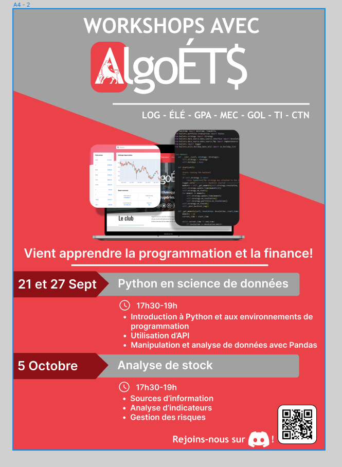

# Python Data Science & Engineering Tutorials




## Table of Contents

- [Overview](#overview)
- [Quick Start](#quick-start)
  - [Requirements](#requirements)
  - [Setup](#setup)
- [Tutorials](#tutorials)
- [How to Contribute](#how-to-contribute)
- [License](#license)
- [Get in Touch](#get-in-touch)

---

## Overview

Welcome to the AlgoETS Python Workshop repository! Here, you'll find a collection of Jupyter Notebooks and Markdown guides designed to elevate your Python skills, especially in data science and software engineering. Whether you're a beginner or seasoned pro, there's something for everyone.

---

## Quick Start

### Requirements

- Python 3.10 or higher
- Jupyter Notebook

### Setup

1. **Clone the Repo**

   ```bash
   git clone https://github.com/AlgoETS/Workshop1.git
   ```

2. **Navigate to Project Directory**

   ```bash
   cd Workshop1
   ```

3. **Install Dependencies**

   ```bash
   pip install -r requirements.txt
   ```

4. **Launch Jupyter Notebook**

   ```bash
   jupyter notebook
   ```

---

## Tutorials

Each tutorial is designed to cover specific topics in Python, giving you hands-on experience.

### `00-install`

- **00_python_environment.ipynb**: Step-by-step guide to setting up your Python environment, including package management with `pip`.

### `01-basic`

- **01_python_basic.ipynb**: Your starting point in Python programming. Learn variables, data types, control structures, and more.

### `02-data`

- **02_python_panda.ipynb**: Dive into data manipulation and exploration using Pandas. Covers DataFrame operations, data cleaning, and basic visualizations.

### `03-visualisation`

- **03_python_visualisation.ipynb**: A comprehensive tutorial on data visualization techniques using Matplotlib and Seaborn.

### `04-api`

- **04_python_api.ipynb**: Understand how to interact with APIs to fetch, process, and analyze real-world data.

### `05-project`

- **05_python_cool_project.ipynb**: A capstone project that combines everything you've learned into a practical, real-world data science application.

---

## How to Contribute

We welcome contributions from the community! Here's how you can contribute:

1. **Fork the Project**
2. **Create a Feature Branch**: `git checkout -b feature/YourFeatureName`
3. **Commit Changes**: `git commit -m 'Describe your changes here'`
4. **Push to Origin**: `git push origin feature/YourFeatureName`
5. **Open a Pull Request**

Check out the [CONTRIBUTING.md](CONTRIBUTING.md) for more guidelines.

---

## License

This project is licensed under the MIT License. For more details, see the [LICENSE](LICENSE) file.

---

## Get in Touch

- **Contact**: Antoine Boucher - [Email](mailto:antoine.boucher@ens.etsmtl.ca)
- **Project Link**: [GitHub - AlgoETS/Workshop1](https://github.com/AlgoETS/Workshop1)

Feel free to reach out if you have any questions or suggestions. Happy Learning! 🚀